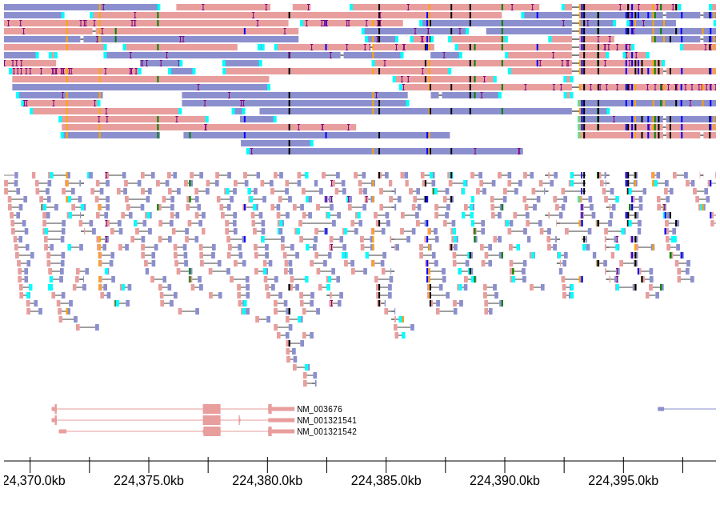

GenomeView Overview
===================

.. toctree::
   :maxdepth: 1
   :caption: Contents:

   details
   convenience
   axis
   bams
   graphs
   rendering
   advanced_usage

What is GenomeView?
===================

GenomeView visualizes genomic data straight from python. Features include:

* Easily extensible
* Integrates with `jupyter notebook <http://jupyter.readthedocs.io/en/latest/index.html>`_ / `jupyterlab <https://github.com/jupyterlab/jupyterlab>`_
* High-quality vector output to standard SVG format
* Includes built-in tracks to visualize:

    * BAMs (short and long reads)

       * Both single-ended and paired-ended views available
       * Includes a cython-optimized quick consensus module to visualize error-prone long-read data
       * Group BAM reads by tag or other features using python callbacks

    * Graphical data such as coverage tracks, wiggle files, etc

The output is suitable for static visualization in screen or print formats. GenomeView is not designed to produce interactive visualizations, although the python interface, through jupyter, provides an easy interface to quickly create new visualizations.

Installation
============

GenomeView requires python 3.3 or greater. The following shell command should typically suffice for installing the latest release:

.. code-block:: bash

    pip install genomeview

Or to install the bleeding edge from github:

.. code-block:: bash

    pip install -U git+https://github.com/nspies/genomeview.git

To display `bigWig <https://genome.ucsc.edu/goldenpath/help/bigWig.html>`_ graphical tracks, the `pyBigWig <https://github.com/deeptools/pyBigWig>`_ python package must also be installed, eg ``pip install pyBigWig``.

Quick Start
===========

To produce the visualization above, a single line of code suffices (in addition to information about the locations of the data and coordinates to be visualized)::

    dataset_paths = ["/path/to/pacbio_single_end_dataset.bam",
                     "/path/to/illumina_paired_end_dataset.bam",
                     "/path/to/genes.bed.gz"]
    reference = "/path/to/reference.fa"
    
    chrom = "chr1"
    start = 224368899
    end =   224398899

    doc = genomeview.visualize_data(dataset_paths, chrom, start, end, reference)

If you are using jupyter notebook or jupyterlab, documents can be displayed simply by placing the name of the document on the last line of a cell by itself and running the cell.

To render the document to file, use the simple :py:func:`genomeview.save()` command::

    genomeview.save(doc, "/path/to/output.svg")   # or .png/.pdf

For more details on setting up your own document with fine-grained control over how the tracks are created and visualized, see the :ref:`next section 
`.
