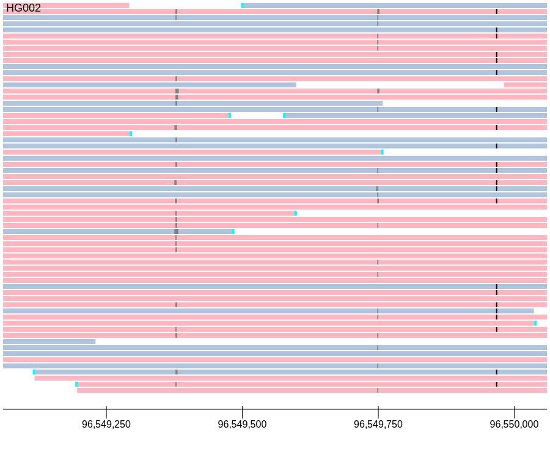

.. _tutorial:

GenomeView Quick Start
======================

GenomeView is a python-based system for visualizing genomic data. This tutorial walks through visualizing reads in a set of BAM files.

Step 1: creating a document
---------------------------

To visualize a set of BAM files, the :py:func:`genomeview.visualize_data()` convenience function can be used::

    dataset_paths = ["/path/to/pacbio_single_end_dataset.bam",
                     "/path/to/illumina_paired_end_dataset.bam",
                     "/path/to/genes.bed.gz"]
    reference = "/path/to/reference.fa"
    
    chrom = "chr1"
    start = 224932967
    end = start + 10000

    doc = genomeview.visualize_data(dataset_paths, chrom, start, end, reference)

The resulting document then includes a track for the PacBio dataset, a second track for the paired-ended Illumina dataset, a third track showing genes from a bed file, and an axis showing the location of the genomic coordinates in the window.

The document includes a view that will visualize reads in the specified region chrom:start-end. For more details on setting up your own document with fine-grained control over how the tracks are created and visualized, see the :ref:`next section 
`.

Step 2: rendering the document
------------------------------

Documents are rendered into SVG format, a standard text-based format used to display graphical objects on the web.

If you are using jupyter notebook or jupyterlab, documents can be displayed simply by placing the name of the document on the last line of a cell by itself and running the cell.

To render the document to file, use the simple :py:func:`genomeview.save()` command::

    genomeview.save(doc, "/path/to/output.svg")

For example, visualizing a 1kb window of a PacBio dataset:

